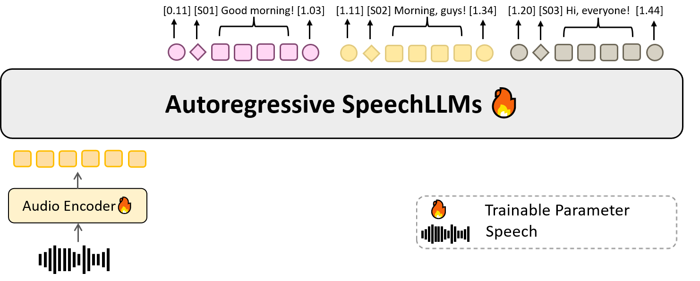

# MOSS-Transcribe-Diarize

<br>

<p align="center">
  
  &nbsp;&nbsp;&nbsp;&nbsp;
  
</p>

<div align="center">
<a href="https://trendshift.io/repositories/78061" target="_blank" rel="noopener noreferrer"></a>
</div>
<div align="center">
  <a href="https://huggingface.co/OpenMOSS-Team/MOSS-Transcribe-Diarize"></a>
  <a href="https://arxiv.org/abs/2601.01554"></a>
  <a href="https://x.com/MosiAI_Official"></a>
</div>

<p align="center">
  <b>English</b> | <a href="./README_zh.md">中文</a>
</p>

MOSS-Transcribe-Diarize 0.9B is an open-source SOTA end-to-end audio understanding model for long-form multi-speaker transcription, diarization, timestamps, and acoustic event awareness. MOSS-Transcribe-Diarize Pro is a stronger model with higher overall performance and will be available through API access soon.

## News

* 2026-07-14: 🏆 MOSS-Transcribe-Diarize won first place in the 2nd MLC-SLM Challenge at INTERSPEECH 2026, covering 14 languages.
* 2026-07-09: Open-sourced MOSS-Transcribe-Diarize 0.9B.

## Contents

- [Introduction](#introduction)
- [Model Architecture](#model-architecture)
- [Evaluation](#evaluation)
  - [Objective Evaluation](#objective-evaluation)
- [Quickstart](#quickstart)
  - [Environment Setup](#environment-setup)
  - [Python Usage](#python-usage)
  - [Serve with SGLang Omni](#serve-with-sglang-omni)
  - [Serve with vLLM](#serve-with-vllm)
  - [Custom Prompt and Hotwords](#custom-prompt-and-hotwords)
  - [Subtitle Web App](#subtitle-web-app)
- [Citation](#citation)
- [Star History](#star-history)

## Introduction

MOSS-Transcribe-Diarize is our flagship SOTA model family for turning real-world long-form audio into structured, speaker-aware transcripts in one pass. Instead of stitching together separate ASR and diarization systems, these models jointly perform speech transcription and speaker diarization, producing time-aligned text with precise timestamps and consistent speaker labels such as `[S01]`, `[S02]`, and beyond.

Built for meetings, calls, podcasts, interviews, lectures, and video content, MOSS-Transcribe-Diarize is designed to handle long, messy, multi-speaker recordings where reliability matters. It can also emit optional acoustic event annotations, giving downstream systems a richer understanding of what happened, who spoke, and when.

MOSS-Transcribe-Diarize supports 50+ languages.

The model accepts raw audio and emits a compact timestamped transcript. The canonical output format is:

```text
[start_time][Sxx]transcribed speech[end_time]
```

Timestamps are expressed in seconds, and adjacent segments are concatenated into a single stream, for example:

```text
[0.48][S01]Welcome everyone[1.66][12.26][S02]The new transcription pipeline is ready for evaluation[13.81][14.36][S01]Great, include the diarization results in the report[18.76]
```

## Model Architecture

<p align="center">
  
</p>

| Component | Specification |
|---|---|
| Text backbone | Qwen3-0.6B style causal decoder |
| Audio encoder | Whisper-Medium encoder configuration |
| Audio frontend | `WhisperFeatureExtractor`, 16 kHz, 80 mel bins, 30 s chunks |
| Audio-text bridge | 4x temporal merge + MLP adaptor |
| Fusion | Audio features replace <code>&lt;&#124;audio_pad&#124;&gt;</code> embeddings via `masked_scatter` |
| Output format | Compact `[start][Sxx]text[end]` transcript with speaker tags such as `[S01]` |

## Evaluation

### Objective Evaluation

We evaluate MOSS-Transcribe-Diarize using three objective metrics: Character Error Rate (CER), concatenated minimum-permutation Character Error Rate (cpCER), and Δcp. Lower is better for all metrics. Best results are bolded, second-best results are underlined. A dash (`-`) indicates that the result is unavailable.

<div style="overflow-x: auto;">
<table style="white-space: nowrap;">
  <thead>
    <tr>
      <th rowspan="2" style="min-width: 220px;">Model</th>
      <th colspan="3" style="text-align:center;">AISHELL&#8209;4</th>
      <th colspan="3" style="text-align:center;">Alimeeting</th>
      <th colspan="3" style="text-align:center;">Podcast</th>
      <th colspan="3" style="text-align:center;">Movies</th>
    </tr>
    <tr>
      <th>CER↓</th><th>cpCER↓</th><th>Δcp↓</th>
      <th>CER↓</th><th>cpCER↓</th><th>Δcp↓</th>
      <th>CER↓</th><th>cpCER↓</th><th>Δcp↓</th>
      <th>CER↓</th><th>cpCER↓</th><th>Δcp↓</th>
    </tr>
  </thead>
  <tbody>
    <tr>
      <td style="white-space: nowrap;">Doubao</td>
      <td>18.18</td><td>27.86</td><td>9.68</td>
      <td>25.25</td><td>37.57</td><td>12.31</td>
      <td>7.93</td><td>10.54</td><td>2.61</td>
      <td>9.94</td><td>30.88</td><td>20.94</td>
    </tr>
    <tr>
      <td style="white-space: nowrap;">ElevenLabs</td>
      <td>19.58</td><td>37.95</td><td>18.36</td>
      <td>25.70</td><td>36.69</td><td>10.99</td>
      <td>8.50</td><td>11.34</td><td>2.85</td>
      <td>11.49</td><td>17.85</td><td>6.37</td>
    </tr>
    <tr>
      <td style="white-space: nowrap;">GPT-4o</td>
      <td>-</td><td>-</td><td>-</td>
      <td>-</td><td>-</td><td>-</td>
      <td>-</td><td>-</td><td>-</td>
      <td>14.37</td><td>23.67</td><td>9.31</td>
    </tr>
    <tr>
      <td style="white-space: nowrap;">Gemini 2.5 Pro</td>
      <td>42.70</td><td>53.42</td><td>10.72</td>
      <td>27.43</td><td>41.64</td><td>14.21</td>
      <td>7.38</td><td>10.23</td><td>2.85</td>
      <td>15.46</td><td>24.15</td><td>8.69</td>
    </tr>
    <tr>
      <td style="white-space: nowrap;">Gemini 3 Pro</td>
      <td>22.75</td><td>27.43</td><td>4.68</td>
      <td>26.75</td><td>32.84</td><td>6.09</td>
      <td>-</td><td>-</td><td>-</td>
      <td>8.62</td><td>14.73</td><td><ins>6.11</ins></td>
    </tr>
    <tr>
      <td style="white-space: nowrap;">VIBEVOICE ASR</td>
      <td>21.40</td><td>24.99</td><td>3.59</td>
      <td>27.40</td><td>29.33</td><td>1.93</td>
      <td>27.94</td><td>48.30</td><td>20.36</td>
      <td>14.59</td><td>42.54</td><td>27.94</td>
    </tr>
    <tr>
      <td style="white-space: nowrap;"><b>MOSS Transcribe Diarize 0.9B</b></td>
      <td><ins>14.84</ins></td><td><ins>15.83</ins></td><td><ins>0.99</ins></td>
      <td><ins>24.86</ins></td><td><ins>22.17</ins></td><td><ins>-2.69</ins></td>
      <td><ins>5.97</ins></td><td><ins>7.37</ins></td><td><b>1.40</b></td>
      <td><ins>6.36</ins></td><td><ins>12.76</ins></td><td>6.40</td>
    </tr>
    <tr>
      <td style="white-space: nowrap;"><b>MOSS Transcribe Diarize Pro</b></td>
      <td><b>13.78</b></td><td><b>14.02</b></td><td><b>0.24</b></td>
      <td><b>18.22</b></td><td><b>13.94</b></td><td><b>-4.27</b></td>
      <td><b>4.46</b></td><td><b>6.97</b></td><td><ins>2.51</ins></td>
      <td><b>5.86</b></td><td><b>11.78</b></td><td><b>5.92</b></td>
    </tr>
  </tbody>
</table>
</div>

## Quickstart

### Environment Setup

Use a clean Python environment. The project is tested with Python 3.12 and Transformers 5.x.

```bash
git clone https://github.com/OpenMOSS/MOSS-Transcribe-Diarize.git
cd MOSS-Transcribe-Diarize
uv venv --python 3.12 .venv
source .venv/bin/activate
uv pip install -e ".[torch-runtime]" --torch-backend=auto
```

For fine-tuning, see [FINETUNING.md](FINETUNING.md).

### Python Usage

```python
import torch
from transformers import AutoModelForCausalLM, AutoProcessor

from moss_transcribe_diarize import parse_transcript
from moss_transcribe_diarize.inference_utils import (
    build_transcription_messages,
    generate_transcription,
    resolve_device,
)

model_id = "OpenMOSS-Team/MOSS-Transcribe-Diarize"
audio_path = "audio.wav"

device = resolve_device("auto")
dtype = torch.bfloat16 if device.type == "cuda" else torch.float32

model = AutoModelForCausalLM.from_pretrained(
    model_id,
    trust_remote_code=True,
    dtype="auto",
).to(dtype=dtype).to(device).eval()
processor = AutoProcessor.from_pretrained(model_id, trust_remote_code=True)

messages = build_transcription_messages(audio_path)
result = generate_transcription(
    model,
    processor,
    messages,
    max_new_tokens=2048,
    do_sample=False,
    device=device,
    dtype=dtype,
)

print(result["text"])

for segment in parse_transcript(result["text"]):
    print(segment.start, segment.end, segment.speaker, segment.text)
```

The message flow follows the common Qwen multimodal pattern. The chat template is loaded from the model by `AutoProcessor`:

1. `processor.apply_chat_template(messages, tokenize=False)` renders text with audio placeholders.
2. `process_audio_info(messages, sampling_rate)` loads audio waveforms from the same messages.
3. `processor(text=text, audio=audios)` computes Whisper input features and expands audio placeholders.
4. `model.generate(...)` produces timestamped transcription and diarization text.

### Serve with SGLang Omni

[SGLang Omni](https://github.com/sgl-project/sglang-omni) is the recommended serving backend for MOSS-Transcribe-Diarize, providing optimized long-form audio inference through the OpenAI-compatible `/v1/audio/transcriptions` endpoint.

SGLang Omni currently targets CUDA 13 environments. Please follow the official [installation guide](https://github.com/sgl-project/sglang-omni/blob/main/docs/get_started/installation.md) for the supported setup. For CUDA 12 environments, the vLLM workflow is also available below.

Download the model:

```bash
hf download OpenMOSS-Team/MOSS-Transcribe-Diarize
```

Serve the model:

```bash
sgl-omni serve \
  --model-path OpenMOSS-Team/MOSS-Transcribe-Diarize \
  --port 8000 \
  --max-running-requests 16 \
  --cuda-graph-max-bs 16 \
  --mem-fraction-static 0.80
```

Use `response_format=verbose_json` when you need parsed speaker segments. `json` returns the raw transcript text only.

```bash
curl -X POST http://localhost:8000/v1/audio/transcriptions \
  -F model=OpenMOSS-Team/MOSS-Transcribe-Diarize \
  -F file=@audio.wav \
  -F response_format=verbose_json
```

```python
import requests

with open("audio.wav", "rb") as f:
    resp = requests.post(
        "http://localhost:8000/v1/audio/transcriptions",
        data={
            "model": "OpenMOSS-Team/MOSS-Transcribe-Diarize",
            "response_format": "verbose_json",
        },
        files={"file": ("audio.wav", f, "audio/wav")},
        timeout=300,
    )

resp.raise_for_status()
payload = resp.json()
print(payload["text"])
for segment in payload.get("segments", []):
    print(f"[{segment['start']:.2f}-{segment['end']:.2f}] {segment['text']}")
```

For longer multi-speaker audio, raise `max_new_tokens` so the decoder can finish the full diarized transcript:

```bash
curl -X POST http://localhost:8000/v1/audio/transcriptions \
  -F model=OpenMOSS-Team/MOSS-Transcribe-Diarize \
  -F file=@audio.wav \
  -F response_format=verbose_json \
  -F max_new_tokens=65536
```

| Parameter | Type | Default | Description |
|---|---|---|---|
| `file` | file | required | Audio file uploaded as multipart form data |
| `model` | string | server default | Model identifier |
| `language` | string | unset | Optional language hint |
| `response_format` | string | `json` | `json`, `verbose_json`, or `text` |
| `temperature` | float | model default (`0.0`) | Sampling temperature |
| `max_new_tokens` | int | `5120` | Max generated tokens; raise for long audio, for example `65536` |
| `prompt` | string | unset | Optional instruction override; omit to use the built-in transcribe+diarize prompt |

For benchmarking, performance numbers, and implementation details, see the [SGLang Omni cookbook](https://github.com/sgl-project/sglang-omni/blob/main/docs/cookbook/moss_transcribe_diarize.md). The following single-H100 results are reported for short- and long-sequence multi-speaker ASR tasks.

`movies` short-sequence ASR:

| Concurrency | Throughput (req/s) | Mean latency (s) | RTF mean | audio_s/s |
|---:|---:|---:|---:|---:|
| 1 | 2.57 | 0.388 | 0.0612 | 29.76 |
| 2 | 4.89 | 0.409 | 0.0659 | 56.55 |
| 4 | 6.62 | 0.513 | 0.0790 | 76.64 |
| 8 | 6.80 | 0.533 | 0.0810 | 78.70 |
| 16 | 7.08 | 0.659 | 0.0922 | 81.98 |

`aishell4_long` long-sequence ASR:

| Concurrency | Throughput (req/s) | Mean latency (s) | RTF mean | audio_s/s |
|---:|---:|---:|---:|---:|
| 1 | 0.022 | 45.2 | 0.0197 | 50.64 |
| 2 | 0.032 | 60.7 | 0.0265 | 74.25 |
| 4 | 0.036 | 105.6 | 0.0461 | 81.64 |
| 8 | 0.040 | 172.6 | 0.0754 | 90.62 |
| 16 | 0.043 | 282.8 | 0.1237 | 98.83 |

### Serve with vLLM

MOSS-Transcribe-Diarize supports vLLM serving through the OpenAI-compatible transcription API. Use a pinned vLLM nightly build that includes the MOSS-Transcribe-Diarize model registration. Choose one of the following commands: for CUDA 12 environments, use `cu129`; for CUDA 13 environments, use `cu130`.

```bash
uv pip install -U vllm \
  --torch-backend=auto \
  --extra-index-url https://wheels.vllm.ai/68b4a1d582818e67adc903bf1b8fc5a5447da2fa/cu129
```

or:

```bash
uv pip install -U vllm \
  --torch-backend=auto \
  --extra-index-url https://wheels.vllm.ai/68b4a1d582818e67adc903bf1b8fc5a5447da2fa/cu130
```

```bash
vllm serve OpenMOSS-Team/MOSS-Transcribe-Diarize --trust-remote-code
```

```bash
curl http://localhost:8000/v1/audio/transcriptions \
  -F model="OpenMOSS-Team/MOSS-Transcribe-Diarize" \
  -F file=@"audio.wav" \
  -F response_format="json" \
  -F temperature="0"
```

### Custom Prompt and Hotwords

The default prompt is optimized for timestamped transcription and speaker diarization:

```text
请将音频转写为文本，每一段需以起始时间戳和说话人编号（[S01]、[S02]、[S03]…）开头，正文为对应的语音内容，并在段末标注结束时间戳，以清晰标明该段语音范围。
```

To add hotwords, append a short hint to the default prompt:

```text
请将音频转写为文本，每一段需以起始时间戳和说话人编号（[S01]、[S02]、[S03]…）开头，正文为对应的语音内容，并在段末标注结束时间戳，以清晰标明该段语音范围。热词提示：热词1, 热词2, 热词3
```

More prompt recipes are available in [examples/prompts.md](examples/prompts.md). The same prompt can be passed to `build_transcription_messages`, `mtd-subtitle`, and `mtd-subtitle-web`.

### Subtitle Web App

The package also includes a local subtitle workflow for upload, review, subtitle export, and optional FFmpeg burn-in:

```bash
mtd-subtitle-web \
  --model OpenMOSS-Team/MOSS-Transcribe-Diarize \
  --host 127.0.0.1 \
  --port 7860
```

Open `http://127.0.0.1:7860`, upload an audio/video file, review the parsed subtitle segments, then download JSON/SRT/ASS or burn an MP4 if `ffmpeg` and `ffprobe` are available on `PATH`.

For batch processing:

```bash
mtd-subtitle /path/to/input.mp4 \
  --model OpenMOSS-Team/MOSS-Transcribe-Diarize \
  --out-dir runs/example \
  --render
```

## Citation

If you use MOSS-Transcribe-Diarize, please cite the technical report:

```bibtex
@misc{moss_transcribe_diarize_2026,
  title={MOSS Transcribe Diarize Technical Report},
  author={{MOSI.AI}},
  year={2026},
  eprint={2601.01554},
  archivePrefix={arXiv},
  primaryClass={cs.SD},
  url={https://arxiv.org/abs/2601.01554}
}
```


## Star History

<a href="https://www.star-history.com/?type=date&repos=OpenMOSS%2FMOSS-Transcribe-Diarize">
 <picture>
   <source media="(prefers-color-scheme: dark)" srcset="https://api.star-history.com/chart?repos=OpenMOSS/MOSS-Transcribe-Diarize&type=date&theme=dark&legend=top-left&sealed_token=Il8QLPD_5o0tps1zgTe1M-lkjb5mdSSINKxV0Dyp1nSc4afmHK0WBqJ02wxe0gXWTBhOwjvUwCn37qbCf1qexm0U1nGmYuY8PDb7XXBJBuynMc_I1QB71w-4QzwfsFgFojRyStdroH1Agu4ISBD5ct1_X5ISNNk5dCu-0NM3OTZ41mqMPjq5Hn0kB6zY" />
   <source media="(prefers-color-scheme: light)" srcset="https://api.star-history.com/chart?repos=OpenMOSS/MOSS-Transcribe-Diarize&type=date&legend=top-left&sealed_token=Il8QLPD_5o0tps1zgTe1M-lkjb5mdSSINKxV0Dyp1nSc4afmHK0WBqJ02wxe0gXWTBhOwjvUwCn37qbCf1qexm0U1nGmYuY8PDb7XXBJBuynMc_I1QB71w-4QzwfsFgFojRyStdroH1Agu4ISBD5ct1_X5ISNNk5dCu-0NM3OTZ41mqMPjq5Hn0kB6zY" />
   
 </picture>
</a>
